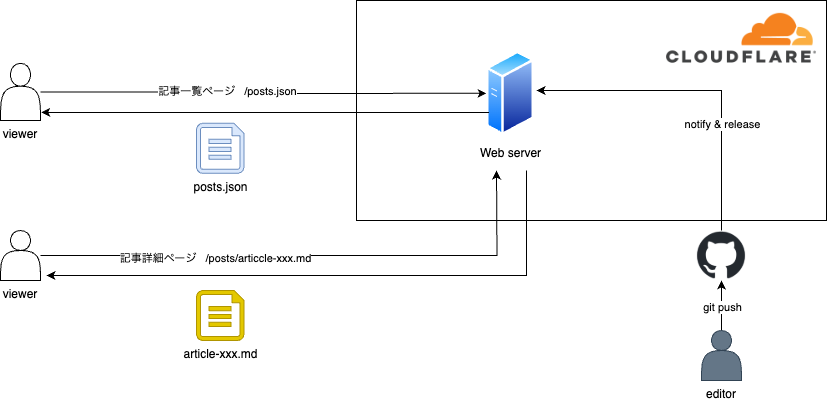

# このブログの技術的詳細について

開発した記憶が薄れないうちにこの記事を書きたかったので、早速書いていきます。

&nbsp;

レポジトリはこちらです。

[yu-tomori/yu-tomori.com](https://github.com/yu-tomori/yu-tomori.com/tree/main)

## まずは要件整理

達成したかったことは以下です。

&nbsp;

- 自分でコードを書くこと（PdMになりコードを書く機会がなくなってしまったため）
- 金銭的に、工数的に、安く運用できること
- 継続的にブログを更新し続けるモチベーションを保てること

&nbsp;

最後のモチベーションの要件が抽象的なので、もう少し明確にしました。↓

### ライティング体験

ブログを書く体験を良くしなければ、書きたい気持ちになれません。そのため、ライティング体験をよくすることを意識しました。

&nbsp;

まず、書くスピードを早めるためにMarkdownで書きたいと思いました。また、ブログを書きながら途中でsaveしたものが、ブラウザ上でプレビューできるのが理想です。

&nbsp;

最終的には、以下の体験を要件としました。

- ローカルでnpm startコマンドでサーバを立ち上げる。ブラウザでlocalhost:3000が立ち上げる。
- VS Codeで新しいmdファイルを作って、markdown形式で書き始められる。
- mdファイルをCTRL+sで一時保存したら、開発サーバのhotreloadが走って、locahost:3000のブラウザタブで最新の内容がプレビューできる

### リリース体験

リリースは極力楽にしたいです。

ローカルで書いてgit pushすればブログがリリースされることを要件に加えました。

## 技術選定

### 結論

```json
"dependencies": {
    "react": "^19.0.0",
    "react-dom": "^19.0.0",
    "react-markdown": "^9.0.3",
    "react-router-dom": "^7.1.1",
    "styled-components": "^6.1.14"
}
```

&nbsp;

ホスティング: Cloudflare pages

### 開発言語

自分が慣れ親しんだ**React.js**を使うことにしました。

&nbsp;

普段はTypeScriptで書くことが多いですが、自分しかコードを書かないのと、コードベースが小さく、複雑なコードを書かないことを鑑みて、素のJSを書くことにしました。

今後機能を拡張したくなったらまた導入を検討すると思います。

&nbsp;

あと、React.jsの開発サーバ周りの知識をつけたかったので、Next.jsやCreate React Appは使わずに、webpackとbabelをちまちま設定しました。

### CSS

- **styled-components**を採用しました。CSS ModulesやTailwindは使ったことがありましたが、styled-componentsは使ったことがなかったので、小さなチャレンジをすることにしました。
- JSXに侵食してくるのでいざとなったときに捨てにくそうだなと感じています。このブログサイトの規模が大きくならない限りは、全て書き直せば良いので特段問題ではないですあ。その時はAI Agentにやってもらいたいと思います。

### その他ライブラリ

- ESLintやPrettierなども使わないことにしました。これも自分しかコードを書かないので要らないという判断です。
- MarkdownからHTMLに変換する必要があり、実績のある**remarkjs/react-markdown**を採用しました。
    - mdファイルをサーバからフェッチした後にブラウザ上でHTMLに変換しています。ローカルかCIサーバでbuildしてHTMLにしちゃうのがベストですが、今後の改善ポイントとしました。
    - HTML ElementごとのデフォルトCSSがありつつElementごとにカスタマイズできるので良いと感じています。
- ルーターは実績のあるReact Routerを採用しました。複雑な遷移がないのでこれで十分です。

### インフラ / CICD

運用費を抑えるために、DBを持たないことにしました。シンプルなブログサイトなので、静的ファイル配信サーバで十分です。

色々と調査した結果、**Cloudflare Pages**を使うことにしました。

&nbsp;

理由

- 無料で使いはじめられる
- CI/CDの設定がちょうぜつ簡単
- 管理画面がシンプルで分かりやすい

&nbsp;

インフラのアーキテクチャはこんな感じです。

&nbsp;



## 振り返り

ブログサイトとしては最小限の構成にしたので、快適に開発できましたし、最速でリリースすることができました。また、運用時に煩わしいこともありません。ブログを書く体験もとても良いです。今のところサーバ費用は0円で助かっています。

&nbsp;

開発中にReact19の機能が気になったのでuseを試してみたり、React自体に興味が湧いて[React Internal Deep Dive](https://jser.dev/series/react-source-code-walkthrough/)を読んだりもしました。
副次的な効果ではありますが、Reactに対する理解が深まりました。
また、今回の開発では開発AI AgentのClineを使ってみました。制御は難しかったですが、とてもよくできたエージェントだなーと思いました。Cline自体の実装が気になってソースコードを読んだりしました。

&nbsp;

今後の展望としては、まずはブログを継続的に書いていきたいと思います。開発面では、読者を意識した小さな改善を積み重ねていきたいと思っています。